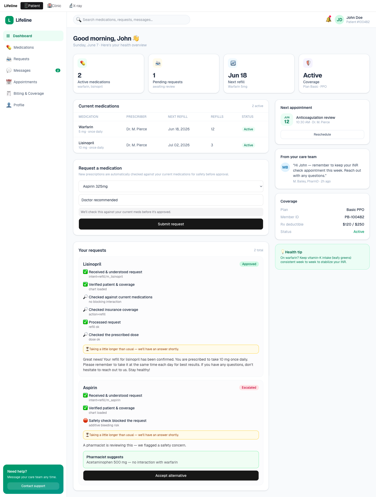
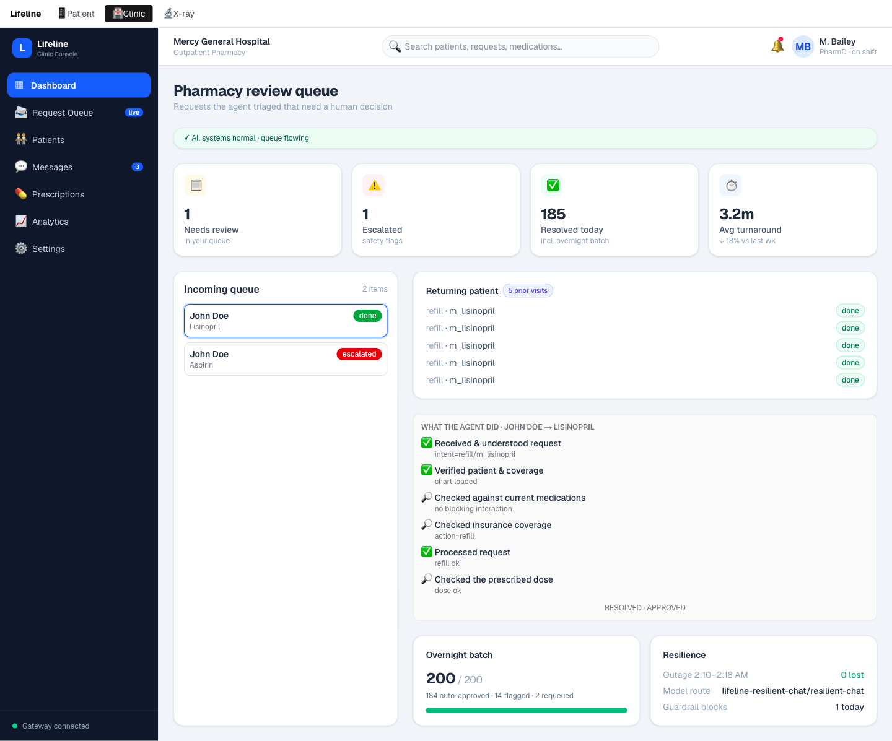
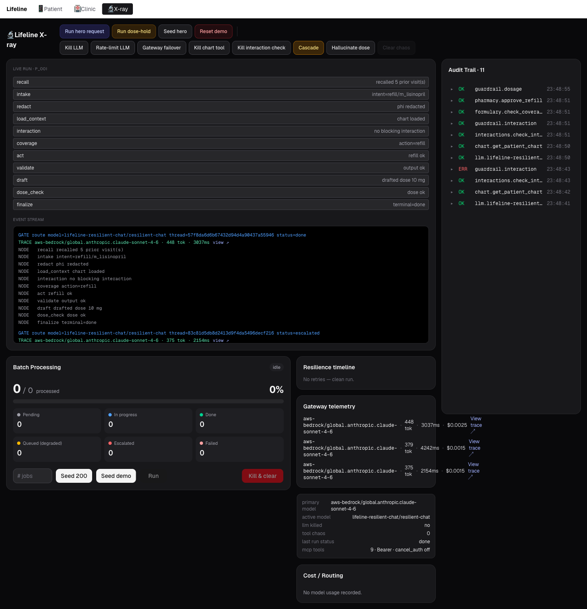
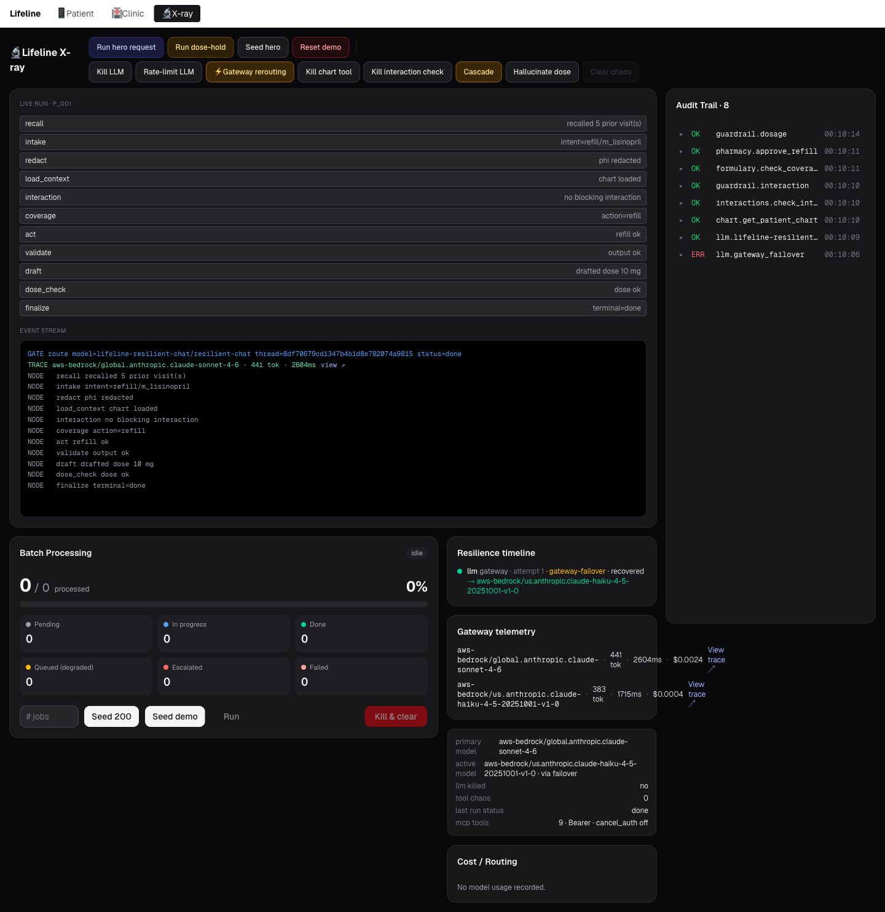
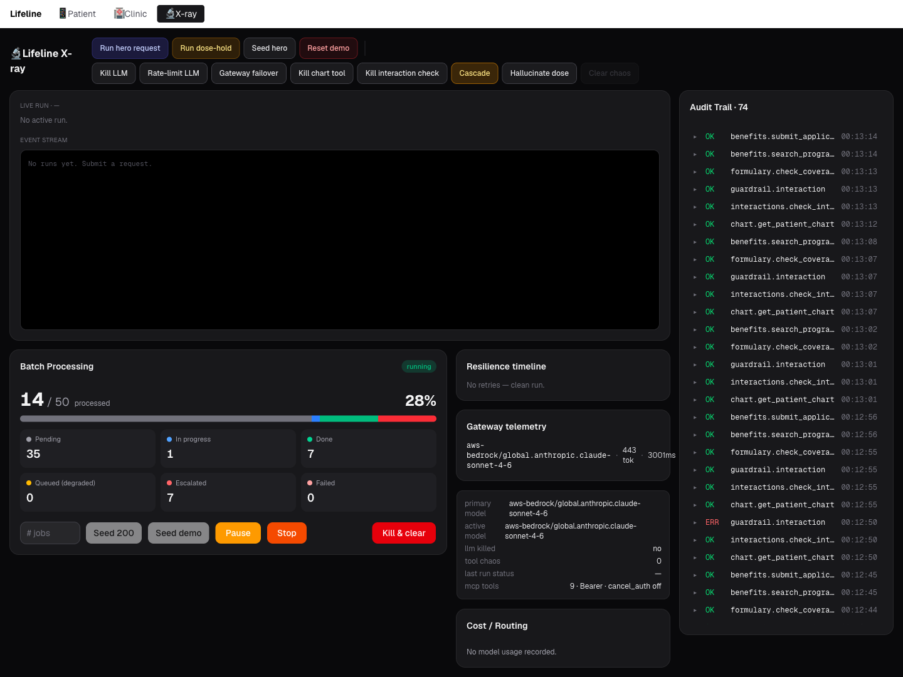

<div align="center">

# 🫀 Lifeline

### A resilient patient medication & coverage agent

**Built for TrueFoundry X AWS *Resilient Agents* hackathon.**

Lifeline automates the slow, error-prone clinical work behind every prescription refill
(interaction checks, dose limits, coverage, patient history) and **keeps serving, safely,
even when its models and tools give out.** Every failure is detected, handled, and shown
live on the TrueFoundry gateway.

[Patient app](https://lifeline-dusky-zeta.vercel.app/patient) ·
[Clinic console](https://lifeline-dusky-zeta.vercel.app/clinic) ·
[X-ray / ops](https://lifeline-dusky-zeta.vercel.app/xray)

</div>

---

## The problem

Infrastructure fails. Rate limits hit. Timeouts happen. Models go down. **Most agents just
crash.** In healthcare a crash means a refill never processed, a coverage check never run, a
safety gate silently skipped.

Lifeline is the agent for a **care coordinator / outpatient pharmacist**, the overworked role
chasing refills, prior-authorizations, and patient-assistance programs across hundreds of
patients. It does that work end to end, and it is engineered so that *when the pieces
underneath it fail, the patient is still served and a human is never blindsided.*

## What it does

One LangGraph pipeline runs in two modes:

- **Interactive:** handle one patient request live (refill / prior-auth / benefit), streamed
  node-by-node.
- **Batch:** grind a backlog (e.g. 200 overnight prior-auths) with durable checkpoint-resume
  and cost-aware model routing.

Three product surfaces sit on top of it.

### Patient app (`/patient`)
What the patient (John Doe) sees: request a refill, watch it get checked node-by-node, see
the outcome. Here a warfarin patient's aspirin request is blocked and escalated with a safe
alternative, while a lisinopril refill is approved.



### Clinic console (`/clinic`)
What the pharmacist (M. Bailey, PharmD) sees: the queue of requests the agent triaged, a plain
"what the agent did" reasoning trail, the safety flag, and approve / override / reject. The
overnight-batch and resilience panels show the agent working at scale.



### X-ray / ops (`/xray`)
The engineer's view, where resilience is made literal: live run, resilience ledger, gateway telemetry, audit trail, and the chaos controls that inject each failure.



---

## Architecture

```
┌──────────────────────────────────────────────────────────────┐
│  Lifeline Dashboard (Next.js · Vercel)                         │
│  /patient · /clinic · /xray  (SSE live runs, SWR polling)      │
└───────────────┬──────────────────────────────────────────────┘
                │ HTTP / SSE
┌───────────────▼──────────────────────────────────────────────┐
│  Lifeline Bridge (Python · FastAPI · LangGraph · DO)          │
│  per-item state graph · durable checkpointer · batch worker   │
│  ToolGateway (retry/backoff/degrade) · ResilienceLog · Audit  │
└──┬───────────────────┬───────────────────┬───────────────────┘
   ▼                   ▼                   ▼
TrueFoundry         TrueFoundry         NeonDB (Postgres)
AI Gateway          MCP Gateway         checkpoints · jobs ·
- virtual model     - scoped virtual      requests
  sonnet→haiku        MCP (9 tools)     HydraDB
  failover          - cancel_auth off   - cross-visit memory
- budget cap        - central auth        (degrade-safe)
- live traces       - audit trail
   │
   ▼
AWS Bedrock  (claude-sonnet-4-6 primary · claude-haiku-4-5 fallback)
```

**Stack:** Python 3.12 · FastAPI · LangGraph · Next.js 16 / React 19 · SWR · Tailwind ·
TrueFoundry AI + MCP Gateways · AWS Bedrock · NeonDB · HydraDB · Vercel · DigitalOcean.

**Two layers of resilience, by design:**
- **Gateway-owned:** model failover, budget cap, routing, observability live *in* the TF
  gateway (no app code).
- **App-owned:** retry/backoff, checkpoint-resume, degrade-to-queue, fail-closed escalation,
  output validation live in the agent.

The agent pipeline:
`recall → intake → redact → load_context → interaction → coverage → act → validate → draft → dose_check → finalize`

---

## Features

Each feature maps to a hackathon judging axis. The `/xray` **resilience ledger** records a
beat for every failure handled.

### 🛡️ Guardrails

**1. Drug-interaction block (input guardrail).**
Before the agent acts, a deterministic interaction check runs as a scoped MCP tool. A
warfarin patient asking for aspirin → *additive bleeding risk* → the request is **blocked and
escalated to a human pharmacist**, with a safe acetaminophen alternative suggested. The gate
is deterministic (a ruleset, not the model) and **fails closed**: if the check service is
down, the request still escalates rather than auto-approving.

**2. Dosage block (output guardrail).**
After a refill is approved, a `draft` node has the gateway LLM write the patient-facing reply
*including a dose*; a `dose_check` node then enforces deterministic dose ceilings. If the
model drafts an unsafe dose (e.g. 80 mg lisinopril over a 40 mg ceiling), it is **blocked
before it ever reaches the patient**. The unsafe number is discarded and the request
escalates. Backed by a real TFY gateway output-guardrail; the app `dose_check` node is
authoritative.

**3. PHI redaction.**
Free-text intake is scrubbed of PHI (SSN, DOB) in a `redact` node before any downstream use.

### 🔀 AI Gateway

**4. Gateway-native model failover.**
Model→model failover lives in a **TFY Virtual Model** (`lifeline-resilient-chat`, priority
routing sonnet→haiku). The app calls *one* model name; the gateway reroutes on 5xx/429/auth
failures. The `/xray` ledger records `gateway-failover · recovered → haiku` and the active-
model panel flips to the served fallback. The app never noticed.



**5. App-level model fallback (Kill LLM).**
A second, independent layer: if the gateway itself is down, the agent's own `ResilientLLM`
degrades to an offline `PatternLLM` so a run still completes. Two failover layers, both visible.

**6. Budget cap + rate limit.**
The virtual model carries a gateway-owned monthly budget cap and request rate limit: genuine
gateway enforcement bounding spend and runaway loops.

### 🔌 MCP Gateway

**7. Scoped tools, centrally controlled.**
All nine tools (chart, formulary, insurer, benefits, pharmacy, interactions) are served
through a scoped virtual MCP behind the TF MCP Gateway. The destructive `insurer_cancel_auth`
is **disabled at the gateway**: present in our code, absent from the gateway's tool list, no
redeploy. Every call is centrally authed (Bearer) and audited.

**8. Tool degradation + recovery.**
Each tool call goes through `ToolGateway` (retry with backoff → degrade when exhausted). Two
principled behaviors: a down **chart** tool → request *queues* for retry-later; a down
**interaction** check → request *escalates to a human* (fail-closed safety). Neither crashes.

### ♻️ Resilience

**9. Retry · backoff · graceful degrade.**
Injectable chaos (rate-limit, timeout, slow, fail, cascade) trips the app's resilience paths
on cue. The `/xray` **Resilience timeline** shows every `attempt → backoff → recovered /
degraded`, with per-node badges. Cascading multi-tool failures each degrade independently and
the run still reaches a terminal state.

**10. Durable state across restart.**
Jobs, requests, and LangGraph checkpoints live in NeonDB. A full bridge redeploy mid-batch
preserves the queue (50 + 10 → 50 + 10). State survives infrastructure failure because it
isn't in memory.



**11. Cross-visit patient memory (degrade-safe).**
A `recall` entry node pulls prior visit outcomes from HydraDB into the run; `finalize` writes
each outcome back. A returning patient's prior flags carry forward ("Previously flagged on a
prior visit"). When HydraDB is down, recall fails, the agent records a `memory · degraded`
beat and **serves the patient anyway**. Memory is a nice-to-have, never a single point of
failure.

### 📈 AI Monitoring

**12. Live gateway traces + telemetry.**
Every gateway LLM call is captured inline from the response: resolved model, prompt/completion
tokens, measured latency, estimated cost, request-id. The `/xray` **Gateway telemetry** panel
shows the live feed, and each row has a **View trace ↗** deep-link that jumps straight into
TrueFoundry's Monitoring console on the exact OTEL trace for that request. Real, not staged.

---

## The X-ray surface

The engineer's view, where resilience is made literal.


- **Live run:** the agent pipeline animating node-by-node, the current node marked with a
  glowing indicator, completed nodes collapsing.
- **Resilience timeline:** one row per failure handled (`retry → recovered`, `degraded`,
  `gateway-failover`, `dosage-block`).
- **Gateway telemetry:** live per-call model / tokens / latency / cost + View-trace links.
- **Audit trail:** every MCP tool call, OK/ERR.
- **Chaos controls:** Kill LLM, Rate-limit, Gateway failover, Kill chart tool, Kill
  interaction check, Cascade, Hallucinate dose. Each arms a real failure path.
- **Batch monitor:** seed and run a backlog; watch durable progress.

---

## Repository layout

```
backend/
  lifeline/
    agent/        LangGraph nodes, graph, LLM clients, guardrails, dosage, memory, pricing, trace
    mcp_servers/  scoped MCP tools (chart, formulary, insurer, benefits, pharmacy, interactions) + aggregate
    bridge/       FastAPI app, narrative humanizer, names, job/request stores
    resilience/   ResilienceLog, TelemetryLog, timeout, run context
    chaos/        chaos controller (the demo failure injector)
    guardrail/    deterministic interaction ruleset
    fixtures/     patients, meds, interactions, plans, prices
  deploy/         Dockerfiles + DigitalOcean app specs
  scripts/        restart_bridge.sh, demo.sh (demo macros)
frontend/
  src/app/        /patient, /clinic, /xray + sub-routes (per-surface layouts)
  src/components/ patient/, clinic/, xray/ component sets
  src/hooks/      useLive (SWR), useNodeStream (SSE)
  src/lib/        api client, types
docs/
  specs/          design specs (one per feature)
  plans/          implementation plans
  runbooks/       demo scripts, deploy + local-stack guides
```

---

## Running locally

**Backend** (Python 3.12):
```bash
cd backend
python3.12 -m venv .venv && .venv/bin/pip install -e .
USE_TF=false .venv/bin/uvicorn lifeline.bridge.app:app --port 8000   # offline, deterministic
```
`USE_TF=true` (with TF gateway env set) routes through the live AI + MCP gateways and records
real traces. See `docs/runbooks/run-local-stack.md` and `docs/runbooks/tf-console-setup.md`.

**Frontend** (Node + pnpm):
```bash
cd frontend
pnpm install
NEXT_PUBLIC_API_BASE=http://localhost:8000 pnpm dev   # http://localhost:3000
```

**Tests:**
```bash
cd backend && .venv/bin/pytest          # backend suite
cd frontend && pnpm test                # vitest
```

**Demo macros** (one shortcut per beat; hits prod by default, `BURL=` overrides):
```bash
bash backend/scripts/demo.sh reset          # clean slate
bash backend/scripts/demo.sh clean-refill   # telemetry + trace
bash backend/scripts/demo.sh failover       # gateway reroute
bash backend/scripts/demo.sh kill-interaction
```

---

## Deployment

- **Frontend** → Vercel (`lifeline`), auto-redeploys on merge to `main`.
- **Bridge + MCP + guardrail** → DigitalOcean App Platform (`doctl apps create-deployment`).
- **Gateways** → TrueFoundry AI + MCP virtual models/MCPs (console setup in
  `docs/runbooks/tf-console-setup.md`).
- **Data** → NeonDB (Postgres), HydraDB (memory).

See `docs/runbooks/do-deploy.md` and `docs/runbooks/tf-deploy.md`.

---

## Demo

A 3-minute walkthrough script lives in `docs/runbooks/demo-video-script-3min.md`, with the
exhaustive per-beat reference (all live-verified results) in `demo-walkthrough-live.md`.

The arc: a warfarin patient's unsafe aspirin request is **blocked and escalated** → a
pharmacist approves a safe alternative → then chaos: an unsafe dose is **caught at the
gateway**, the interaction service is **killed and the agent fails closed**, the gateway
**reroutes a dead model**, and every gateway call's **real trace** is one click away. The
resilience ledger fills with a row for every failure handled.

> *An agent built to stay up when everything else falls down.*
